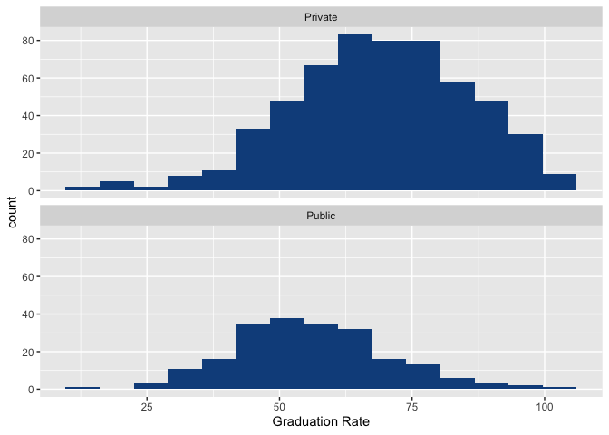
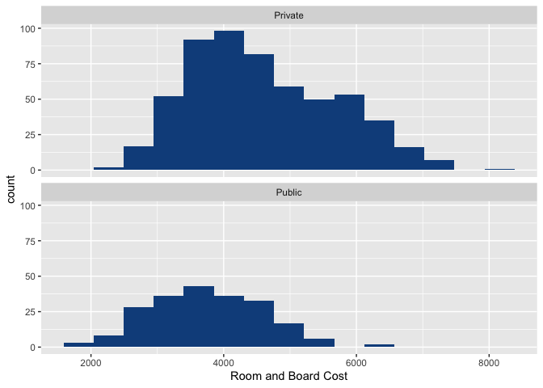

Untitled
================

Including Code
--------------

``` r
library(tidyverse)
```

    ## ── Attaching packages ─────────────────────────────────────── tidyverse 1.3.1 ──

    ## ✓ ggplot2 3.3.5     ✓ purrr   0.3.4
    ## ✓ tibble  3.1.4     ✓ dplyr   1.0.7
    ## ✓ tidyr   1.1.4     ✓ stringr 1.4.0
    ## ✓ readr   2.0.2     ✓ forcats 0.5.1

    ## ── Conflicts ────────────────────────────────────────── tidyverse_conflicts() ──
    ## x dplyr::filter() masks stats::filter()
    ## x dplyr::lag()    masks stats::lag()

``` r
colleges <- read.csv("College_Data.csv")
```

``` r
colleges_percent <- colleges %>%
  mutate(percent_acc = Accept/Apps)
```

``` r
cost <- colleges_percent %>%
  mutate(total = Room.Board + Books + Personal) %>%
  filter(!Grad.Rate >= 101) %>%
  mutate(re_private = ifelse(Private == "Yes", "Private", "Public")) %>%
  select(-Private) %>%
  rename(Private = re_private)
```

``` r
ggplot(cost, aes(x = Grad.Rate)) +
  facet_wrap(~Private, nrow = 2) +
  geom_histogram(fill = "dodgerblue4") +
  labs(x = "Graduation Rate",
       title = "Graduation rates for private and public colleges")
```

    ## `stat_bin()` using `bins = 30`. Pick better value with `binwidth`.



``` r
grad_rate_sum <- cost %>%
  group_by(Private) %>%
  summarise(median = median(Grad.Rate),
            min = min(Grad.Rate),
            max = max(Grad.Rate))
grad_rate_sum
```

    ## # A tibble: 2 × 4
    ##   Private median   min   max
    ##   <chr>    <dbl> <int> <int>
    ## 1 Private     69    15   100
    ## 2 Public      55    10   100

``` r
ggplot(cost, aes(x = Room.Board)) +
  facet_wrap(~Private, nrow = 2) +
  geom_histogram(fill = "dodgerblue4") +
  labs(x = "Room and Board Cost",
       title = "Room and board costs for private and public colleges")
```

    ## `stat_bin()` using `bins = 30`. Pick better value with `binwidth`.



``` r
rb_cost_sum <- cost %>%
  group_by(Private) %>%
  summarise(median = median(Room.Board),
            min = min(Room.Board),
            max = max(Room.Board))
rb_cost_sum
```

    ## # A tibble: 2 × 4
    ##   Private median   min   max
    ##   <chr>    <dbl> <int> <int>
    ## 1 Private   4400  2370  8124
    ## 2 Public    3708  1780  6540
